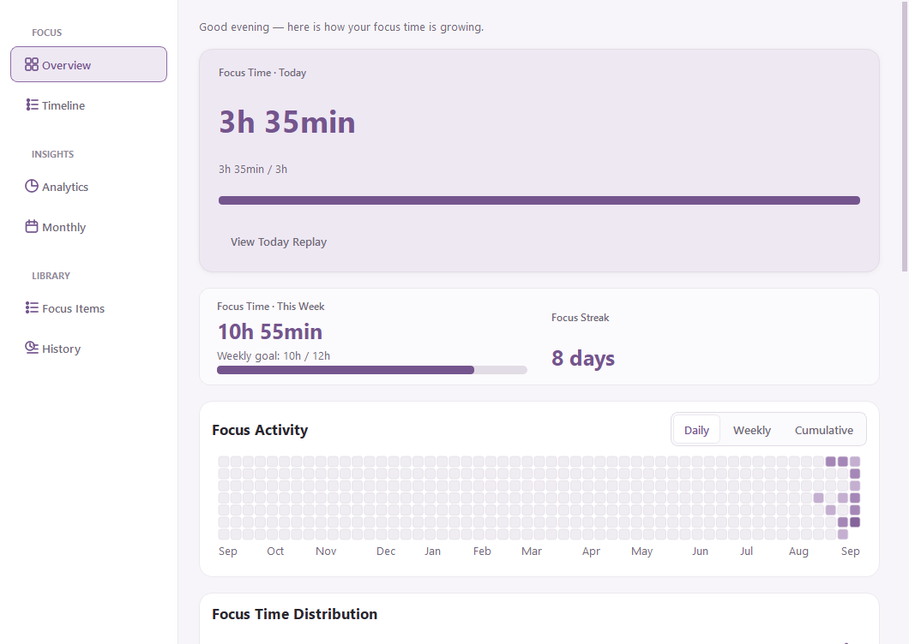
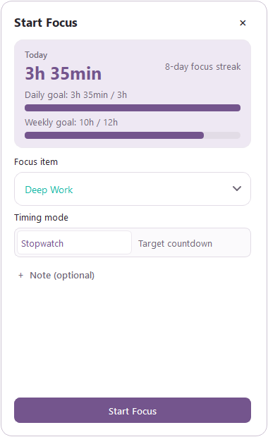
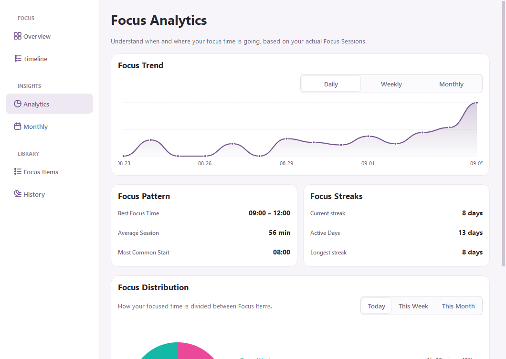
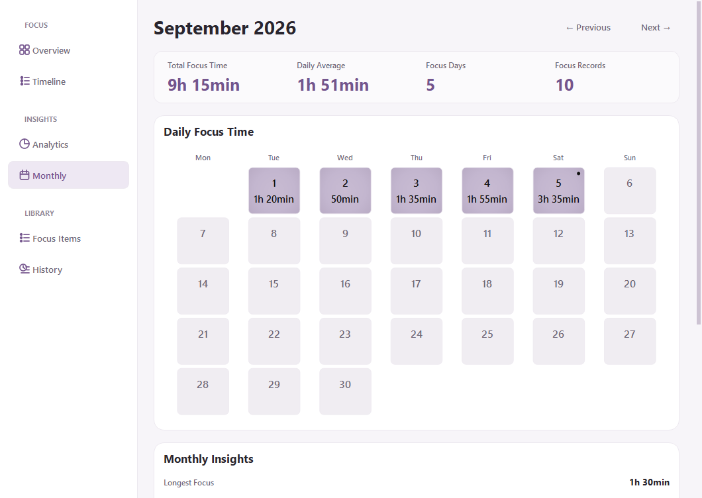
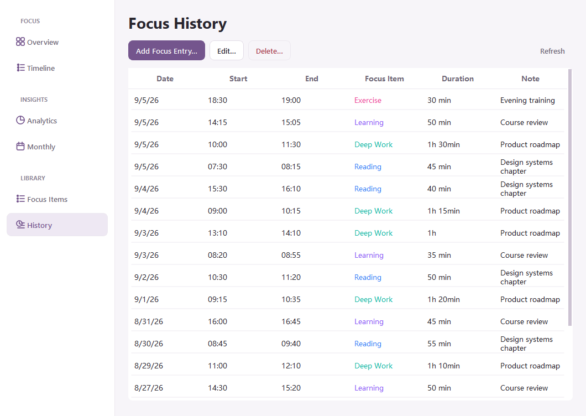
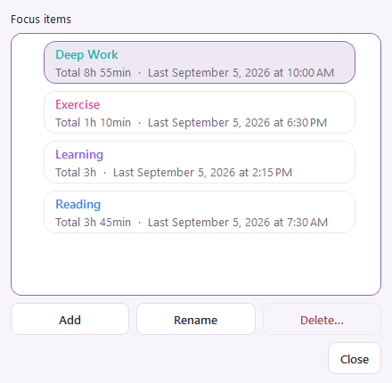
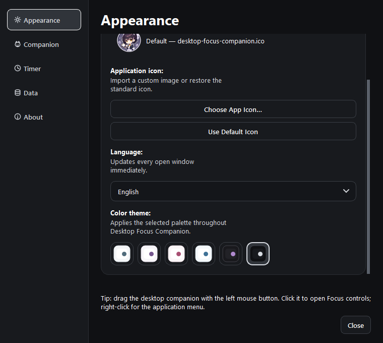

[English](README.md) | [简体中文](README.zh-CN.md)

<a id="desktop-focus-companion"></a>

<div align="center">
  
  <h1>Desktop Focus Companion</h1>
  <p>A local-first Windows focus tracker with a customizable desktop companion.</p>
  <p>
    <a href="https://github.com/Natsumekawaii/desktop-focus-companion/releases/latest"><strong>Download for Windows</strong></a>
    ·
    <a href="README.zh-CN.md">简体中文</a>
  </p>
  <p>
    
    
    
    
    
  </p>
</div>

---

Desktop Focus Companion is a local-first focus tracker for Windows. It combines a lightweight desktop companion, stopwatch and countdown sessions, a true-time timeline, analytics, a monthly calendar, and editable history in one calm desktop experience. No account or cloud service is required.



## Quick start

1. Open [Releases](https://github.com/Natsumekawaii/desktop-focus-companion/releases/latest) and download `DesktopFocusCompanion-Setup-*.exe`.
2. Run the installer. It installs for the current user and normally requires no administrator permission.
3. Launch the app from the Start menu. Left-click the companion to open Focus controls; right-click it for the application menu.
4. Pick a Focus Item and timer mode, then start your first session.

> [!NOTE]
> Public builds are currently unsigned, so Windows SmartScreen may display a warning on first launch. Download only from this repository's Releases page and compare the file with the published SHA-256 checksum.

## Highlights

- **Lightweight companion** — move, resize, or replace it with a PNG/JPG/JPEG/WEBP image, and optionally customize the application icon.
- **Two timer modes** — use Stopwatch for open-ended work or Countdown for a defined time box.
- **Safe session handling** — pause, resume, recover after interruption, and retry a pending save without silently losing progress.
- **Actionable insights** — Today, seven-day trends, Focus Item distribution, time patterns, Focus Streaks, yearly activity, and daily replay.
- **True-time timeline** — records stay aligned to their real start and end times, including short, overlapping, and cross-midnight sessions.
- **Monthly review** — a compact activity calendar with totals, averages, best day, longest session, and leading Focus Items.
- **Editable history** — add, edit, and delete manual records while retaining item colors and notes.
- **Bilingual and themeable** — Simplified Chinese／English and six themes: Default, Lavender, Pink, Blue, Dark, and Charcoal.
- **Windows integration** — tray menu, Start menu shortcut, optional desktop shortcut, and optional startup entry.

## Product tour

<table>
  <tr>
    <td width="50%"><strong>Focus panel</strong><br></td>
    <td width="50%"><strong>True-time timeline</strong><br></td>
  </tr>
  <tr>
    <td><strong>Analytics</strong><br></td>
    <td><strong>Monthly calendar</strong><br></td>
  </tr>
  <tr>
    <td><strong>Focus history</strong><br></td>
    <td><strong>Focus Item management</strong><br></td>
  </tr>
</table>

### Six application-wide themes



## Data and privacy

- Focus records, preferences, logs, and custom assets stay under `%LOCALAPPDATA%\DesktopFocusCompanion` by default.
- The app requires no account, uploads no Focus content, and contains no telemetry or advertising service.
- Normal upgrades and the built-in uninstaller preserve the user database and preferences. To remove everything, exit the app and delete the data directory yourself.
- Version 1.0 has no cloud sync, automatic backup, or automatic updater. Back up the data directory if the records are important to you.

See [Data safety](docs/data-safety.md) and [Database schema](docs/database.md) for implementation details.

## Run from source

Requirements: Windows 10/11 and 64-bit Python 3.12.

```powershell
git clone https://github.com/Natsumekawaii/desktop-focus-companion.git
cd desktop-focus-companion
py -3.12 -m venv .venv
.\.venv\Scripts\python.exe -m pip install -r requirements-dev.txt
.\.venv\Scripts\python.exe main.py
```

Run the complete quality gate:

```powershell
.\quality.ps1
```

Build the portable application and installer:

```powershell
.\.venv\Scripts\python.exe -m pip install -r requirements-build.txt
.\build.ps1
.\build-installer.ps1
```

If Inno Setup 6 is missing, `build-installer.ps1 -InstallDependencies` can install the verified dependency explicitly. Build output is written to `dist\` and is not committed.

## Repository layout

```text
app/        application, data, timer, analytics, and Qt UI
assets/     bundled companion image and Windows icons
installer/  Inno Setup definition and localized messages
scripts/    maintenance tools, including README captures
tests/      unit, component, regression, and acceptance tests
docs/       architecture, database, safety, and i18n notes
```

## Documentation

- [Architecture](docs/architecture.md)
- [Database schema](docs/database.md)
- [Data safety](docs/data-safety.md)
- [Internationalization](docs/i18n.md)
- [Verification guide](docs/verification.md)

## Contributing

- Read [CONTRIBUTING.md](CONTRIBUTING.md) before opening an issue or pull request.
- Report vulnerabilities privately using [SECURITY.md](SECURITY.md); do not publish sensitive details in an issue.
- Release history is maintained in [CHANGELOG.md](CHANGELOG.md).
- The project is available under the [MIT License](LICENSE).

Known limitations: only 64-bit Windows builds are provided; releases are unsigned; cloud sync, a web client, and automatic updates are not included.

[Back to top](#desktop-focus-companion) · [简体中文](README.zh-CN.md)
