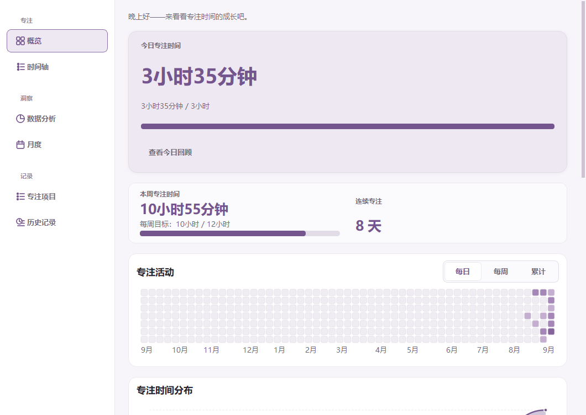
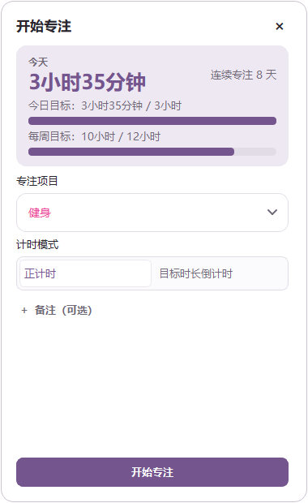
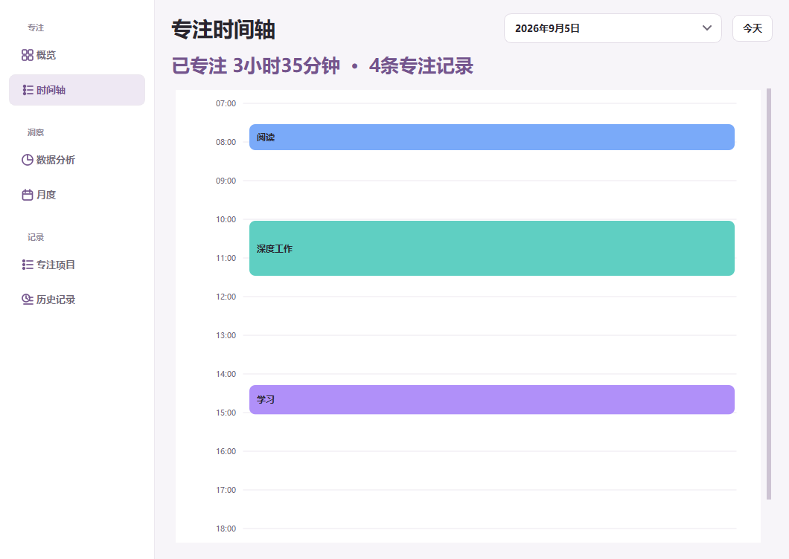
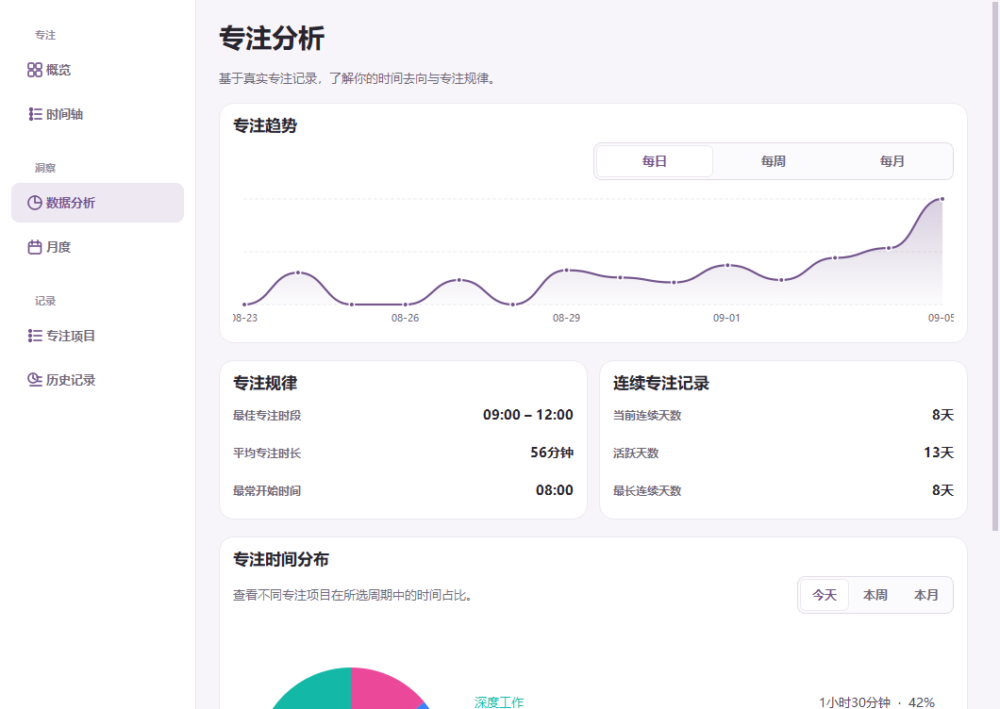
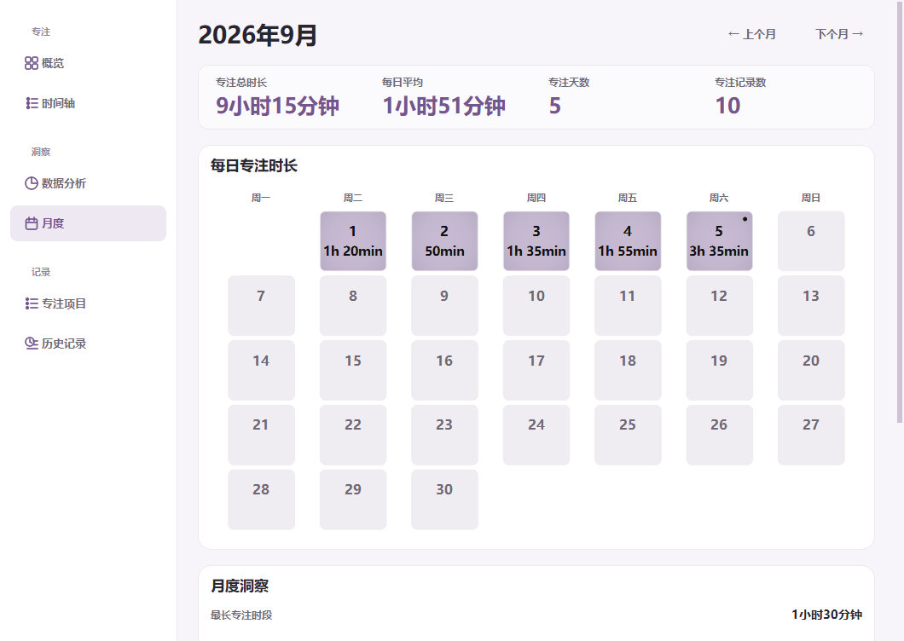
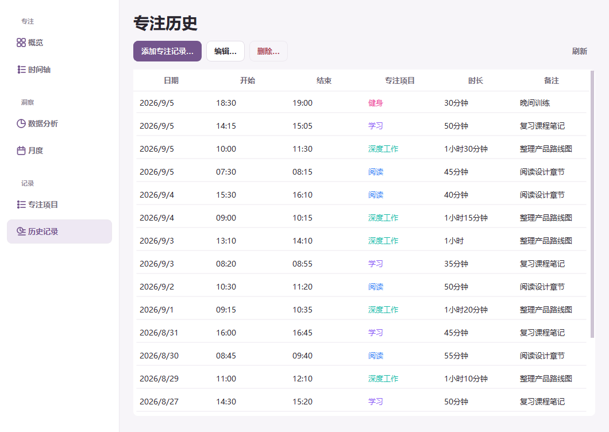
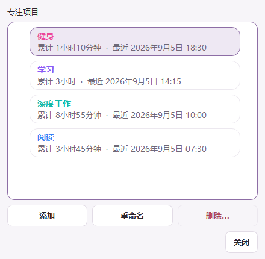
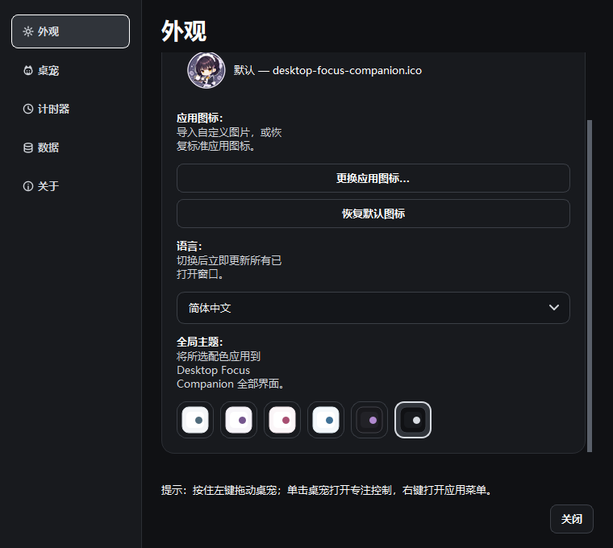

[简体中文](#readme-zh) · [English](#readme-en)

<div align="center">
  
  <h1>Desktop Focus Companion</h1>
  <p>A local-first Windows focus tracker with a customizable desktop companion.</p>
  <p>
    <a href="https://github.com/Natsumekawaii/desktop-focus-companion/releases/latest"><strong>Download for Windows</strong></a>
    ·
    <a href="#readme-zh">中文介绍</a>
    ·
    <a href="#readme-en">English overview</a>
  </p>
  <p>
    
    
    
    
    
  </p>
</div>

---

<a id="readme-zh"></a>

## 简体中文

Desktop Focus Companion 是一款面向 Windows 的本地专注记录应用。它把轻量桌宠、正计时／倒计时、时间轴、趋势分析、月历和历史管理整合在一个安静、清晰的桌面体验里。数据默认只保存在你的电脑上，不需要账号，也不依赖云端服务。



### 快速开始

1. 打开 [Releases](https://github.com/Natsumekawaii/desktop-focus-companion/releases/latest)，下载 `DesktopFocusCompanion-Setup-*.exe`。
2. 运行安装器。应用采用当前用户安装，通常不需要管理员权限。
3. 安装完成后从开始菜单启动；单击桌宠打开专注面板，右键桌宠打开应用菜单。
4. 在专注面板中选择项目和计时模式，开始第一段专注记录。

> [!NOTE]
> 当前公开构建尚未进行代码签名，Windows SmartScreen 可能在首次运行时显示提醒。请只从本仓库的 Releases 页面下载安装包，并核对 Release 中提供的 SHA-256。

### 功能一览

- **轻量桌宠**：可拖动、缩放、更换 PNG/JPG/JPEG/WEBP 图片，并支持自定义应用图标。
- **两种计时方式**：正计时适合开放式任务；倒计时适合明确的时间盒。
- **安全记录**：暂停、恢复、异常退出恢复与待保存重试，避免意外丢失专注进度。
- **完整洞察**：今日概览、七日趋势、项目分布、专注时段、连续专注、年度活动矩阵和每日回顾。
- **精确时间轴**：按真实起止时间绘制记录，支持短记录、重叠分栏和跨午夜展示。
- **月度视图**：紧凑月历、活跃日、月度总时长、日均、最佳日期和项目排行。
- **记录管理**：新增、编辑、删除人工记录，并在历史表格中保留项目颜色和备注。
- **双语与主题**：简体中文／English，以及 Default、Lavender、Pink、Blue、Dark、Charcoal 六套主题。
- **Windows 集成**：系统托盘、开始菜单、可选桌面快捷方式和可选开机启动。

### 界面预览

<table>
  <tr>
    <td width="50%"><strong>专注面板</strong><br></td>
    <td width="50%"><strong>真实时间轴</strong><br></td>
  </tr>
  <tr>
    <td><strong>数据分析</strong><br></td>
    <td><strong>月度日历</strong><br></td>
  </tr>
  <tr>
    <td><strong>专注历史</strong><br></td>
    <td><strong>项目管理</strong><br></td>
  </tr>
</table>

#### 六套全局主题



### 数据与隐私

- 所有专注记录、设置、日志和自定义资源默认保存在 `%LOCALAPPDATA%\DesktopFocusCompanion`。
- 应用不要求登录，不上传专注内容，也不包含遥测或广告服务。
- 普通升级和原生卸载不会删除用户数据库及设置；如需彻底移除数据，请在退出应用后自行删除上述目录。
- 当前版本没有云同步、自动备份或自动更新。重要记录建议定期备份用户数据目录。

更详细的可靠性设计参见 [数据安全说明](docs/data-safety.md) 和 [数据库说明](docs/database.md)。

### 从源码运行

要求：Windows 10/11、64 位 Python 3.12。

```powershell
git clone https://github.com/Natsumekawaii/desktop-focus-companion.git
cd desktop-focus-companion
py -3.12 -m venv .venv
.\.venv\Scripts\python.exe -m pip install -r requirements-dev.txt
.\.venv\Scripts\python.exe main.py
```

运行全部质量检查：

```powershell
.\quality.ps1
```

构建便携程序与安装包：

```powershell
.\.venv\Scripts\python.exe -m pip install -r requirements-build.txt
.\build.ps1
.\build-installer.ps1
```

Inno Setup 6 未安装时，可使用 `build-installer.ps1 -InstallDependencies` 显式安装依赖。生成物位于 `dist\`，不会提交到 Git。

### 项目结构

```text
app/        应用、数据、计时、统计和 Qt 界面
assets/     默认桌宠与 Windows 图标
installer/  Inno Setup 安装器定义与语言文件
scripts/    README 截图等维护工具
tests/      单元、组件、回归与验收测试
docs/       架构、数据库、数据安全和国际化文档
```

### 参与项目

- 提交问题前请先阅读 [贡献指南](CONTRIBUTING.md)。
- 安全问题请按照 [安全策略](SECURITY.md) 私下报告，不要公开敏感细节。
- 版本变化记录在 [CHANGELOG](CHANGELOG.md)。
- 本项目采用 [MIT License](LICENSE)。

已知限制：当前只提供 Windows 64 位构建；安装包尚未签名；暂无云同步、网页端或自动更新服务。

[返回顶部](#desktop-focus-companion) · [Switch to English](#readme-en)

---

<a id="readme-en"></a>

## English

Desktop Focus Companion is a local-first focus tracker for Windows. It combines a lightweight desktop companion, stopwatch and countdown sessions, a true-time timeline, analytics, a monthly calendar, and editable history in one calm desktop experience. No account or cloud service is required.


### Quick start

1. Open [Releases](https://github.com/Natsumekawaii/desktop-focus-companion/releases/latest) and download `DesktopFocusCompanion-Setup-*.exe`.
2. Run the installer. It installs for the current user and normally requires no administrator permission.
3. Launch the app from the Start menu. Left-click the companion to open Focus controls; right-click it for the application menu.
4. Pick a Focus Item and timer mode, then start your first session.

> [!NOTE]
> Public builds are currently unsigned, so Windows SmartScreen may display a warning on first launch. Download only from this repository's Releases page and compare the file with the published SHA-256 checksum.

### Highlights

- **Lightweight companion** — move, resize, or replace it with a PNG/JPG/JPEG/WEBP image, and optionally customize the application icon.
- **Two timer modes** — use Stopwatch for open-ended work or Countdown for a defined time box.
- **Safe session handling** — pause, resume, recover after interruption, and retry a pending save without silently losing progress.
- **Actionable insights** — Today, seven-day trends, Focus Item distribution, time patterns, Focus Streaks, yearly activity, and daily replay.
- **True-time timeline** — records stay aligned to their real start and end times, including short, overlapping, and cross-midnight sessions.
- **Monthly review** — a compact activity calendar with totals, averages, best day, longest session, and leading Focus Items.
- **Editable history** — add, edit, and delete manual records while retaining item colors and notes.
- **Bilingual and themeable** — Simplified Chinese／English and six themes: Default, Lavender, Pink, Blue, Dark, and Charcoal.
- **Windows integration** — tray menu, Start menu shortcut, optional desktop shortcut, and optional startup entry.

### Product tour

<table>
  <tr>
    <td width="50%"><strong>Focus panel</strong><br></td>
    <td width="50%"><strong>True-time timeline</strong><br></td>
  </tr>
  <tr>
    <td><strong>Analytics</strong><br></td>
    <td><strong>Monthly calendar</strong><br></td>
  </tr>
  <tr>
    <td><strong>Focus history</strong><br></td>
    <td><strong>Focus Item management</strong><br></td>
  </tr>
</table>

#### Six application-wide themes


### Data and privacy

- Focus records, preferences, logs, and custom assets stay under `%LOCALAPPDATA%\DesktopFocusCompanion` by default.
- The app requires no account, uploads no Focus content, and contains no telemetry or advertising service.
- Normal upgrades and the built-in uninstaller preserve the user database and preferences. To remove everything, exit the app and delete the data directory yourself.
- Version 1.0 has no cloud sync, automatic backup, or automatic updater. Back up the data directory if the records are important to you.

See [Data safety](docs/data-safety.md) and [Database schema](docs/database.md) for implementation details.

### Run from source

Requirements: Windows 10/11 and 64-bit Python 3.12.

```powershell
git clone https://github.com/Natsumekawaii/desktop-focus-companion.git
cd desktop-focus-companion
py -3.12 -m venv .venv
.\.venv\Scripts\python.exe -m pip install -r requirements-dev.txt
.\.venv\Scripts\python.exe main.py
```

Run the complete quality gate:

```powershell
.\quality.ps1
```

Build the portable application and installer:

```powershell
.\.venv\Scripts\python.exe -m pip install -r requirements-build.txt
.\build.ps1
.\build-installer.ps1
```

If Inno Setup 6 is missing, `build-installer.ps1 -InstallDependencies` can install the verified dependency explicitly. Build output is written to `dist\` and is not committed.

### Repository layout

```text
app/        application, data, timer, analytics, and Qt UI
assets/     bundled companion image and Windows icons
installer/  Inno Setup definition and localized messages
scripts/    maintenance tools, including README captures
tests/      unit, component, regression, and acceptance tests
docs/       architecture, database, safety, and i18n notes
```

### Contributing

- Read [CONTRIBUTING.md](CONTRIBUTING.md) before opening an issue or pull request.
- Report vulnerabilities privately using [SECURITY.md](SECURITY.md); do not publish sensitive details in an issue.
- Release history is maintained in [CHANGELOG.md](CHANGELOG.md).
- The project is available under the [MIT License](LICENSE).

Known limitations: only 64-bit Windows builds are provided; releases are unsigned; cloud sync, a web client, and automatic updates are not included.

[Back to top](#desktop-focus-companion) · [切换到简体中文](#readme-zh)
